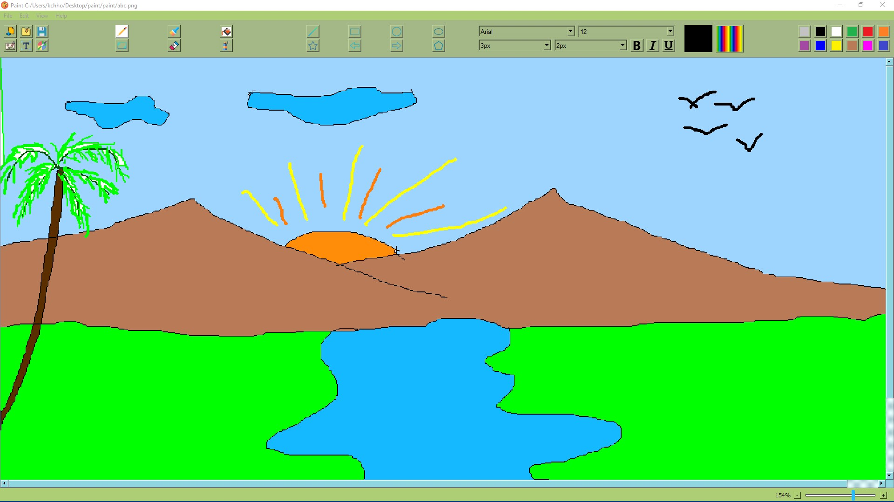
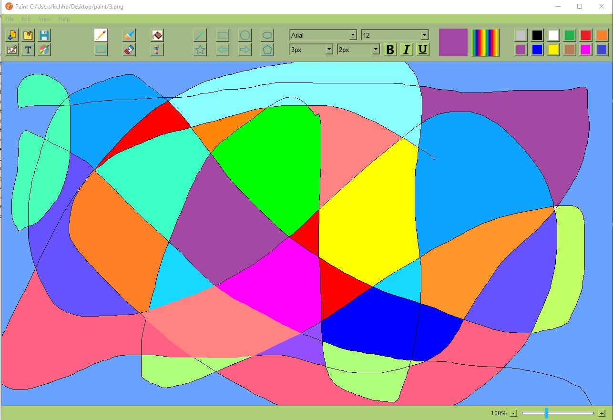
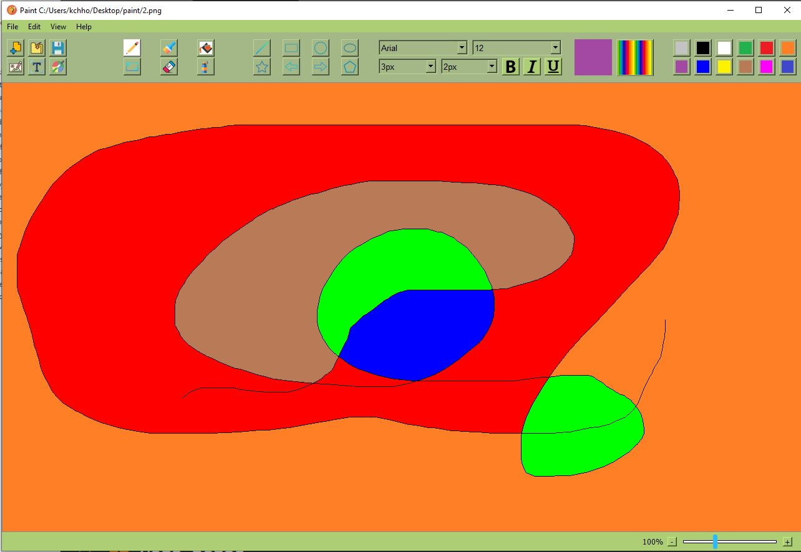
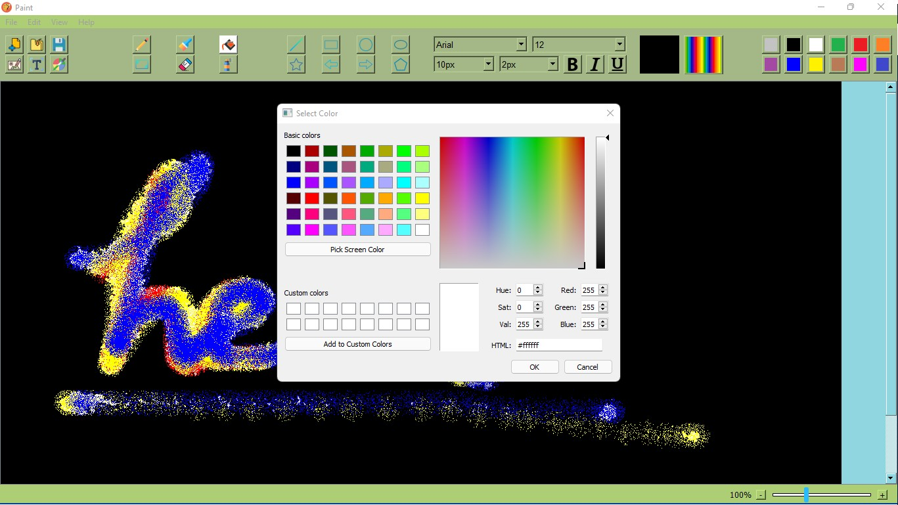
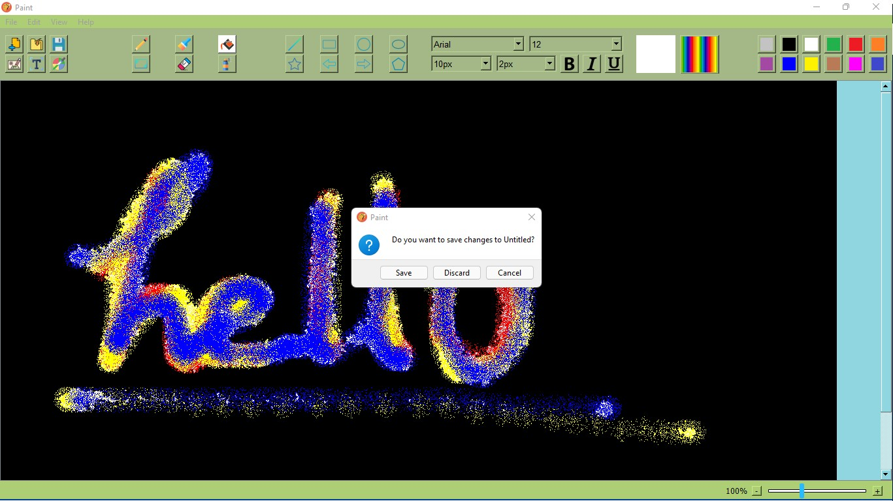

# Paint - A Desktop Application in Python using PyQt5

## About the project
Paint is a 2D desktop application for colorfull drawing and sketching.


## Built With
This application is made completely in python using pyqt5 library.
* [Pyqt5](https://pypi.org/project/PyQt5/)
## Getting Started
Download the Project folder and run the main.py file
## Prerequisites
* install pyqt5
  ```sh
  pip install pyqt5
  ```
## Screenshots







## Painting/Drawing Tools
* ### pen - free drawing
* ### line - for drawing straight line
* ### paint brush - for thick drawing
* ### flood fill - to fill a region with a color
* ### select - for selecting a rectangular region
* ### eraser - for erasing
* ### spray tool - for spraying paint
* ### text tool - for writing text
* ### color-picker - pick color from the sketch

## Standard Drawing Shapes
* ### rectangle
* ### ellipse
* ### circle
* ### star
* ### arrow left
* ### arrow right
* ### pentagon

## Features/Functionality
* ### Undo/Redo Feature
    This is important feature of Paint application. It allows user to go back to the previous state of the drawing from current state and vice-versa.
* ### Save Feature
    User can save his/her drawing into disk in (png or jpg) image format.
* ### Print Feature
    User can print his/her drawing.
* ### Text Writing
    User can write text on his/her drawing or an existing image.
* ### Insert Picture
    User can insert a picture into his/her drawing.
* ### image cropping
    User can crop a picture and save the cropped picture as new picture.
* ### Zoom In/Out feature
    User can zoom in/out.
## Developers
* ### Chhotu Kumar ME18B045 IIT MADRAS 2021
